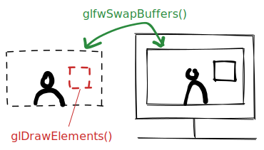
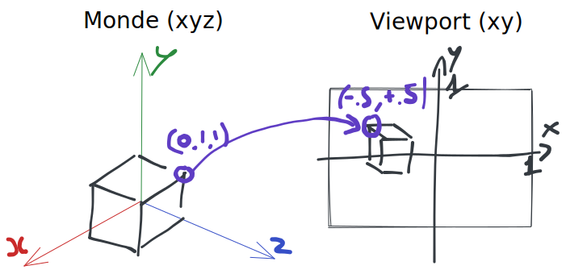
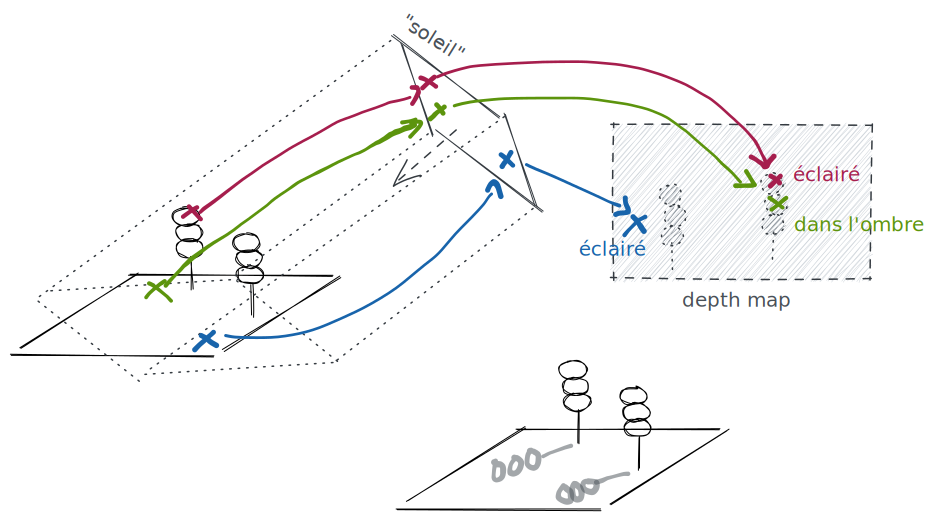
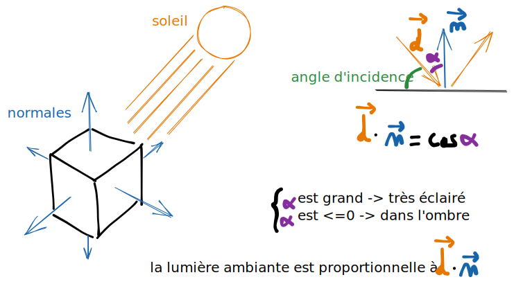

# Concepts avancés en OpenGL

## La swap chain

Quand on appelle des fonctions `glClear`, `glDrawElements`... on ne modifie pas directement la zone visible de l'écran ; à la place on modifie une image qui n'est pas affichée. Pour afficher cette image on appelle `glfwSwapBuffers` qui inverse l'image visible et celle qu'on vient de modifier.
En terme de performances on cherchera à faire ce cycle au moins 60 fois pas secondes (60 fps, 60 Hz), on est donc limité à ~16ms par *frame*.



<!-- c'est pas très précis mais c'est pour ne pas écrire plus que ca -->

## Les coordonnées

OpenGL ne définit pas de système de coordonnées globales, seulement celles du *viewport* (la zone affichable) de $(-1,-1)$ à $(1,1)$. Ces coordonnées ne dépendent pas de la taille de la fenêtre, si elle n'est pas carré tout sera déformé (étiré dans une direction).

Plutôt que de tout calculer en fonction du viewport on définira des coordonnées du monde (xyz). On placera les objets dans ce système et la caméra se chargera de rapporter (projeter) ces coordonnées à celles du viewport, cela permet de facilement prendre en compte le zoom, les rotations...



> Techniquement les points projetés sont sur un repère (xyzw) dans le viewport, z symbolise la distance à la caméra et w vaut toujours 1. Ce qui est important à retenir ici est que les deux n'ont rien à voir et qu'on passe de l'un à l'autre par une projection.

## La caméra et les transformations

Une fois qu'on arrive à afficher des objets on va chercher à les déplacer à l'écran. Mais modifier les vbo à chaque frame est *très* couteux en temps. On fera plutôt ce calcul sur le gpu à l'aide d'une caméra.

En 2D, une caméra peut être définie par un rectangle en coordonnées du monde. Tout ce qui est dans le rectangle sera visible et vice versa.

> [!attention] Attention, des maths arrivent !

Mathématiquement, si le rectangle de la caméra est défini par $(x_1,y_1,x_2,y_2)$ on doit rapporter cet intervalle aux coordonnées du viewport :

$$ (x,y) \mapsto (\frac{x-x_1}{x_2-x_1},\frac{y-y_1}{y_2-y_1}) $$

ou

$$
p \mapsto Ap\quad
A=\begin{pmatrix}
\frac{1}{x_2-x_1} & 0 & \frac{-x_1}{x_2-x_1}\\
b & \frac{1}{y_2-y_1} & \frac{-y_1}{y_2-y_1}\\
0 & 0 & 1
\end{pmatrix},
p=\begin{pmatrix} x \\ y \\ 1 \end{pmatrix}
$$

Un des avantages du gpu sur le cpu est qu'il est très performant dans le calcul de matrices, donc la deuxième solution est tout a fait viable même si elle semble plus compliquée c'est souvent ce qui est choisit.

En 3D on utilise le même mécanisme mais avec des matrices 4x4 et des points $(x,y,z,1)$.

> La quatrième coordonnée a un sens mathématique, pour les "points" on la met à 1 et pour les "vecteurs" on la met à 0, ce qui fait que les vecteurs ne sont pas affectés par les translations (les matrices de translations n'ont des éléments que dans la 4ème colonne).

TODO schema

> [!info]
> 
> Mathématiquement les matrices 4x4 permettent de faire transformations linéaires, dont les translations, les rotations, les projections et les mises à l'échelle (TODO trouver le bon nom).
> 
> Les opérations peuvent être chainées : si $A$ est une matrice de translation et $B$ est une matrice de rotation, alors $A.(B.p) = (A.B).p$ et on peut précalculer $C=A.B$ côté cpu et laisser le gpu faire le calcul $C.p$ pour chaque vertex.

En 3D on cumule les trois matrices $MVP$ pour Model, View, Projection. $M$ est la matrice qui décrit la transformation de l'objet, $V$ celle de la caméra et $P$ permet de projeter un point de l'espace sur le viewport.

TODO schéma Ortho/Perspective

Le code classique du vertex shader :

```glsl
#version 330 core

layout(location = 0) in vec3 i_position;
// [...]

uniform mat4 u_M;
uniform mat4 u_VP;

void main()
{
  // attention à bien appliquer M *avant* VP
  gl_Position = u_VP * u_M * vec4(i_position, +1.0);
}
```

## Les ombres

### Ombres portées

Pour les ombres portées, le plus "simple" est d'afficher le monde entier "du point du vue du soleil", en conservant l'information de distance. On obtient une *depth map* qu'on peut ensuite utiliser pour vérifier si un point est dans l'ombre ou pas :



Le soleil ne peut pas être placé infiniement loin et ne peut pas couvrir une région infiniment grande, donc il faut savoir comment le placer pour que tous les éléments visibles par la caméra principale soient dans le viewport du soleil **et** que tous les éléments pouvant projeter une ombre y soient aussi, mais pas forcément entièrement.

TODO détailler le calcul pour le placement

TODO screen

### Ombres ambiantes

Un calcul très simple pour le calcul des ombres se fait à partir des normales des surfaces :



Cela implique qu'une normale soit stockée dans chaque vertex.
