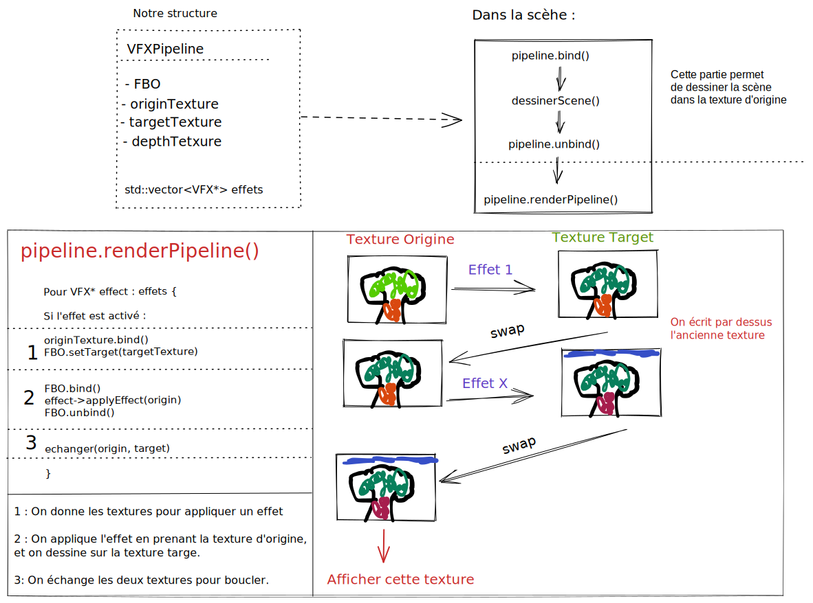

> [!Mots clés]
> post-processing, framebufferobject, depth buffer, pipeline, retouche

# Les effets de post-processing

Le terme *post-processing* réfère à l'ensemble des ajustements des couleurs de pixels qui sont réalisés **après** le rendu de la scène. C'est exactement le même principe que de la retouche d'image que l'on pourrait avoir sous *Photoshop* par exemple.

L'une des grosses différences, c'est qu'on peut avoir accès à certaines informations sur la distance des pixels par rapport à la caméra par exemple, ou différents points de vus de la scène, qui peuvent donner naissance à des effets très appréciables. 

L'implémentation des effets de post-processing se fait principalement à l'aide des `FrameBufferObject`. On attache une texture à ces objets, et tous les `drawCalls` dessinent sur cette texture. On peut soit afficher cette texture sur un rectangle de la taille de l'écran - ce qui ne sert pas à grand chose (on redessine la scène originale) - soit lui appliquer des modifications. Concrètement, on a pris en "photo" la scène, et on va la retoucher.

> [!attention]
> Cette section ne traitera pas des effets en détails. Ils seront abordés individuellements ou en groupe selon la difficulté de leur nature, et dans des fichiers séparés.

## La pipeline graphique des effets

Nous avons mis en place une *pipeline* de rendu des effets

Le principe d'une pipeline, comme celle d'OpenGL, est de prendre des données en entrées, et de leur appliquer des opérations pour les afficher à l'écran.
Celle d'OpenGL effectue énormément de traitements pour changer la position, déterminer les contours des triangles, quels pixels sont dans les triangles... elle est compliquée, et nous pouvons interragir avec elle au moyen des *shaders*, principalement avec les Vertex et Fragment shaders que nous avons pu voir plus tôt.

![[Pasted image 20221031223039.png]]

Dans notre cas, on se contentera de prendre une texture (celle sur laquelle nous avons dessiné la scène), et de jouer avec les couleurs. Nous pouvons connaitre la distance caméra - pixel grâce au `Depth buffer`, une sorte de texture / mémoire tampon que nous pouvons générer lors du rendu de la scène.



La pipeline que nous avons mis en place fonctionne de la manière suivante : 
On attache le `FrameBufferObject` de la pipeline à OpenGL. Ensuite, on dessine notre scène (qui va se dessiner sur la texture `originTexture` de la pipeline), puis on va appliquer nos effets à cette texture. 
Successivement, l'application d'un effet sur la texture d'origine produit une nouvelle texture `targetTexture`. Il faut donc récupérer cette target et en faire l'origine, pour n'avoir besoin que de deux textures pour l'ensemble de la pipeline.
Au final, au terme d'un dernier `swap` entre les deux textures, on affiche à l'écran la texture `originTexture`. 

> [!info]
> On fait du recyclage de texture ! 


Vous pouvez voir que notre pipeline contient une liste de *VFX*. Cette classe abstraite sert de base pour tous les effets spéciaux. 

![[Pasted image 20221101121626.png]]

Pour l'instant, libre à l'utilisateur de choisir quels effets il ajoute dans sa scène parmi ceux que nous avons implémenté, et libre à lui de choisir l'ordre dans lequel il les ajoute. Mais il y a un problème.

> **L'ordre d'application des effets a un important.** 

Si j'ai un  pixel *P = (0.5 , 1 , 0 , 1)* , que je procède à une inversion des couleurs, soit *1-P*, puis que j'ajoute du bleu, on obtient *P' = (0.5, 0, 1, 1)*, alors que dans l'autre sens, on a *P'' = (0.5, 0, 0, 1)*.

Cette expérience de pensée est suffisante pour justifier l'importance de garder un ordre. 

Ci-contre la pipeline de ==Unity==. L'ordre et le sens unidirectionel y est bien mis en évidence : 

![[Pasted image 20221031225409.png]]

Nous avons donc besoin de définir une structure avec un ordre prédéfini, ainsi qu'une méthode pour trier notre liste d'effets activés selon cette structure.
Heureusement, ce problème convient parfaitement à une `énumération` !

Nous allons donc créer une énumeration `EffectType`, et chacune des classes dérivées de VFX contiendra la une macro qui implémente la méthode `getType`. Cette macro prend en paramètre un type d'effet venant de `EffectType`, et "écrit" l'implémentation de la méthode, qui renvoit ce type.

-----------
```
#define EFFECT_CLASS_TYPE(type) virtual EffectType getType() const override {return EffectType::##type;}\

	enum EffectType {
		na=-1,
		ContrastEffect,
		SaturationEffect,
		SharpnessEffect,
		BloomEffect,
		SBFEffect,
		GammaCorrectionEffect,
		TonemapperEffect
	} ;
``` 
----------

On écrit alors dans la corps de la classe `Contrast.h` :

--------
```
EFFECT_CLASS_TYPE(ContrastEffect);
```
----------

Ainsi, si l'on parcourt la liste d'effet de la VFXPipeline, on peut demander le type de l'effet que l'on regarde, le comparer à la position (représentée par un entier dans une `enum`), puis le placer à la bonne position dans la liste.

> [!Info]
> Cette implémentation implique que l'on n'ajoute un effet qu'une fois, ce qui n'a pas vraiment d'incidence sur le bon fonctionnement du programme, du rendu, ou du fonctionnement du reste du monde d'ailleurs. Qui appliquerait deux fois de la saturation ?
