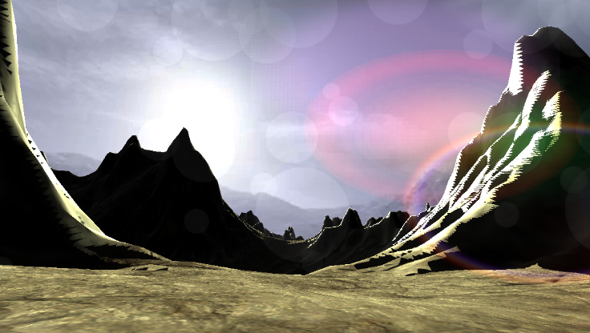
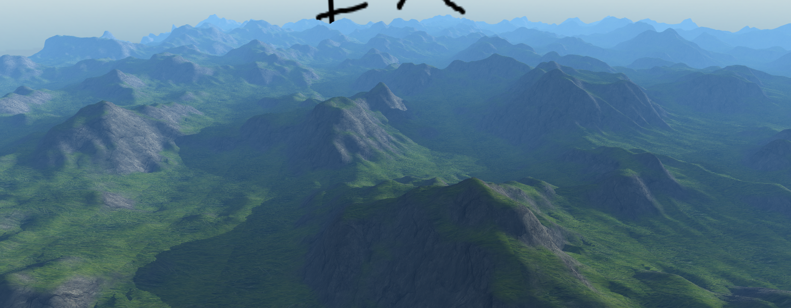
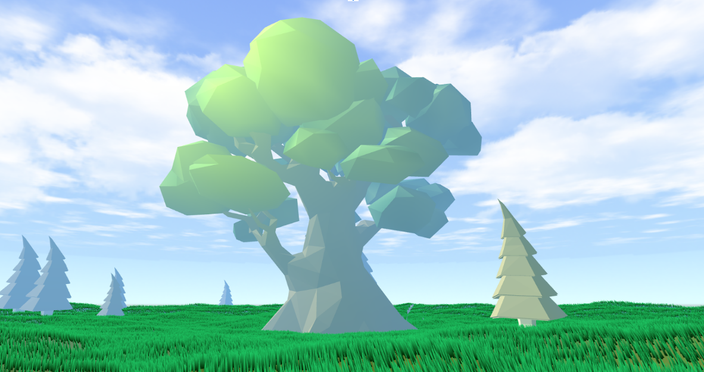
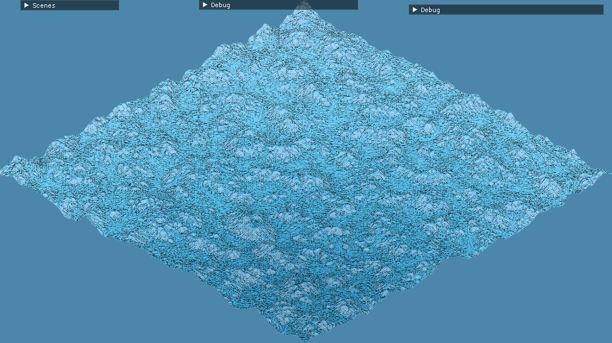
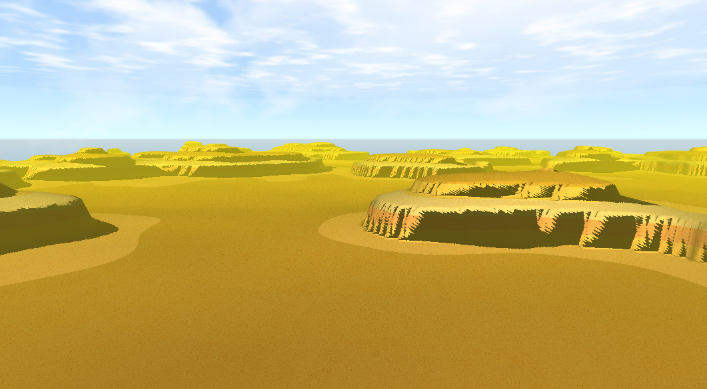
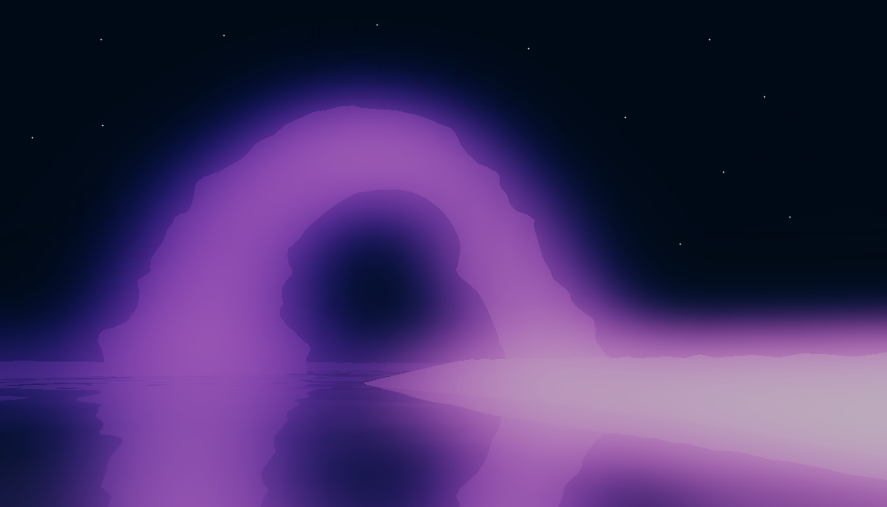
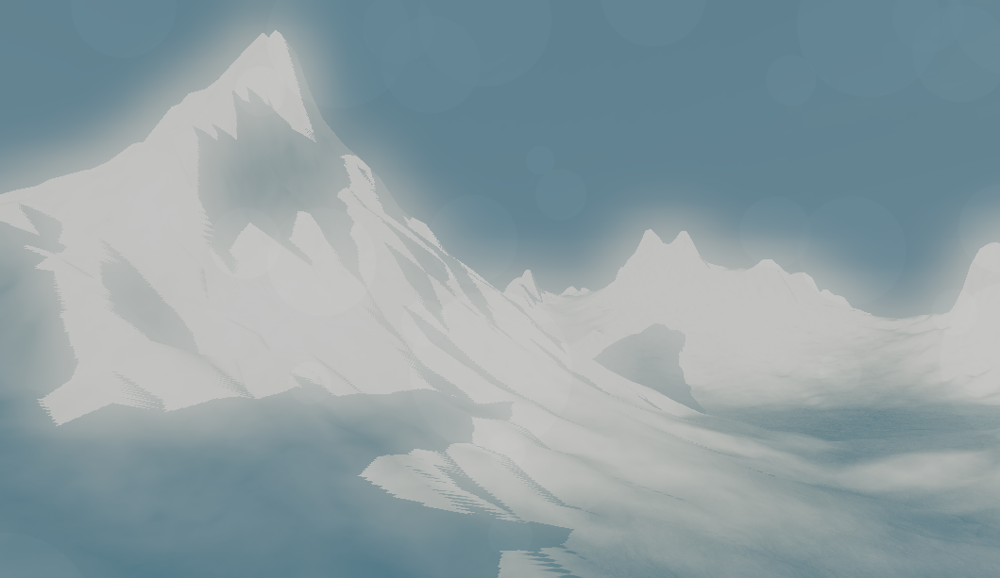

# MarbleEngine

Our terrain generation and 3D rendering engine for our software quality course.

## Final screenshots

### roadmap

**OpenGL abstraction**:
- [x] VBO/IBO/Shaders
- [x] Mesh
- [x] FBO
- [x] On-the-fly shader recompilation

**Terrain**:
- [x] Heightmap generation
- [x] Mesh generation
- [x] Realistic generation (=erosion)

**Monde**:
- [x] Features (trees/grass...)
- [x] Skybox
- [x] Clouds
- [ ] ? Day/night cycle
- [x] Rivers/Oceans

**Camera**:
- [x] Player movements
- [x] Perspective/Isometric

**VFX**:
- [x] Ambiant shadows
- [x] Casted shadows
- [ ] ? Ambiant occlusion
- [x] HDR
- [x] Bloom
- [x] Vignette
- [x] Distance fog
- [x] Dirt mask

**Animations**:
- [ ] Mesh animations
- [x] ? Wind
- [ ] ? Rain
- [x] Nuages
- [ ] ? Day/night cycle

