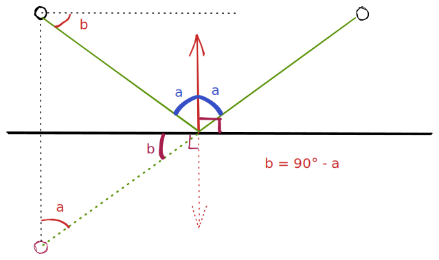
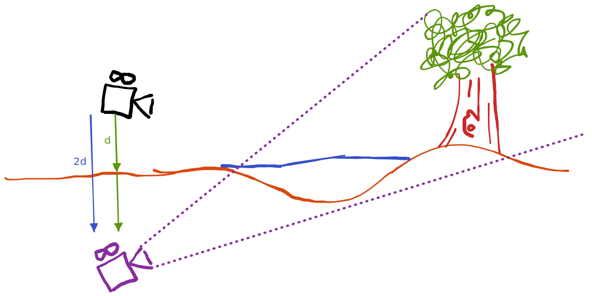

Crééons de l'eau. Voici le résultat que nous obtenons à la fin :

![[eau2.mp4]]

---

# Le plan

Pour dessiner de l'eau, on va utiliser une méthode peu couteuse mais qui donne de jolis résultats.
L'eau ne sera qu'un plan, et nous allons travailler et produire une texture dynamique que nous allons lui appliquer.

L'avantage, c'est la simplicité, la rapidité et des résultats très satisfaisants.
Malheureusement, l'eau n'est pas interactive, et ne modèlise pas la vraie mécanique des fluides ! 
Dans notre contexte, c'est largement suffisant, puisque nous ne voulons que contempler ; dans les jeux, il faudrait penser à utiliser une grille de Vertices, des particules...

---

## Rélfexion, réfraction

Dans cette partie, on va calculer ce que l'eau doit réflechir ou réfracter.
Pour se faire, on va dessiner la scène de plusieurs points de vue dans des framebuffers.

### En théorie

La première étape consiste à regarder le comportement de l'eau dans la réalité.
On peut noter deux choses très importante concernant la lumière.

Elle est *réflechie* et *refractée*. 

![[Pasted image 20221121090947.png]]


Ici, le **dioptre**, c'est l'eau. En théorie, le calcul du rayon d'incidence dépend de l'indice de réfraction du milieu, c'est à dire 1.3 pour l'eau.

>[!info]
>L'indice de réfraction n'a pas d'unité !


Dans notre cas, on se contente de dire que l'angle de refraction est nul. Ceci dit, il est assez simple de modéliser ce phénomène, mais comme le plan ne possède pas d'informations sur le dioptre que nous voulons modéliser, on généralise ce phénomène au plus simple.

Similairement, le calcul de l'angle de réfléction est une symmétrie par rapport à la normale de la surface. Nous verrons plus tard que les normales de notre texture ne sont pas parfaitement perdendiculaires au plan, mais nous allons faire comme si.

### Implémentation

Pour simuler la réflexion, on va supposer que la normale est perpendiculaire au plan.
On peut donc dire que la normale est la bissectrice de l'angle, et grâce aux superbes théorèmes des angles vus au collège, on peut obtenir le placement de la caméra à avoir pour réussi à obtenir l'angle de vu souhaité: 



Il suffit donc de trouver la base du triangle formé par la position de la caméra, le point de contact avec l'eau et la position de la caméra dans le sol et avec un angle de vue inversé.

Si d est la distance au sol depuis la caméra, on doit donc dessiner la scène depuis le point `{camera.x, camera.y - 2*d, camera.z}` avec un `pitch = -camera.pitch'. 

>[!Rappels]
> Le pitch représente la rotation sur l'axe X, donc si une caméra regarde le sol et que l'on inverse son pitch, elle regarde le ciel.
> De plus, comme l'angle est en radians, on peut dire que l'inverse du pitch est -pitch.



>[!Warning]
>Ca n'est pas tout !

On voit un problème : la caméra dessine le sol qui est sous l'eau. Il faut trouver un moyen de dessiner la scène mais ==uniquement ce qu'il y a au dessus de l'eau== !

Heureusement, OpenGL nous donne un moyen assez simple de résoudre ce problème grâce aux `clippings planes`. 

Il s'agit de variables que l'on peut activer via `glEnable(GL_CLIPPING_PLANEX)`. Ensuite, dans le vertex shader, on peut donner une valeur qui représente la hauteur du plan dans l'espace du monde.

On va donc ajouter un uniform qui représentera la hauteur de la source d'eau que l'on veut, puis utiliser :

```
uniform vec4 u_plane; // La source d'eau à dessiner

int main() {

  vec4 worldPos =  u_M * vec4(i_position, +1.0); // le point dans le monde
  gl_ClipDistance[0] = dot(worldPos, u_plane);


//...
}
```

OpenGL va se charger tout seul de ne pas rendre les vertices dont les positions sont ==sous== le clipping plane. Ainsi, nous pouvons dessiner uniquement ce qu'il y a au dessus de l'eau.

Pour la réfraction, on applique le même principe, mais on passe une normale dans l'autre sens pour le clipping plane. Ainsi, on dessine dans un framebuffer (une nouvelle fois) uniquement ce que la caméra voit SOUS l'eau.

#### Calcul des positions de la texture

A ce stade, nous avons rendu la scène deux fois dans deux textures : une texture représente la réflection, en se placant sous terre et et ne voyant que ce qu'il y a au dessus de l'eau, et une autre voit uniquement ce qu'il y a sous l'eau, depuis le point de vue de la caméra originale.

L'enjeu est de combiner ces textures puis de les afficher sur la plan.
Pour ce qui est de mélanger les textures, un simple appel à la fonction `mix` de GLSL permet d'interpoler les valeurs. Pour l'instant, on se contente de mixer équitablement les textures, et donc on applique un coefficient de 0.5.

Le problème est le suivant : les 4 points du plan sont les extrémités de la texture, et si on affiche simplement une interpolation des textures sur le plan, on obtient un résultat complétement chaotique, dû à un problème de coordonnées.

![[Pasted image 20221121145729.png]]

Les textures sont "écrasées" pour rentrer dans la dimension du plan, alors qu'on voudrait conserver les points dans l'espace de l'écran. On peut facilement passer d'une type de dimensions à l'autre via les calcul suivants :

Calcul des points du plan dans le clipSpace (vertex Shader): 

 `clipspace = u_VP * u_M * vec4(position, +1.0);`

Calcul des points dans le screenSpace (de 0 à 1, fragment Shader):

```  vec2 screenSpace = vec2((clipSpace.xy / clipSpace.w)+1) * 0.5 ; ```

Enfin, lorsque l'on récupère les textures sur les Sampler2D, on utilise ces coordonnées, et maintenant, l'eau est correcte.
![[Pasted image 20221121145901.png]]

---

## Mouvement

On va maintenant s'amuser à faire de l'eau qui bouge. 
On va utiliser une texture un peu particulière : une texture de distortion.

Elle resemble à ca :

![[dudvWater.png]]

Chaque pixel encode une direction. On prend en x la valeur rouge du pixel, et en y la valeur du vert. On en profite aussi pour changer les intervalles via :

`vec2 distortion = vec2(texture(distortionTexture, screenSpace).xy)) * 2.0f - 1.0f ;`

On peut ensuite déplacer nos coordonnées en fonction de ce vecteur.
On en profite également pour ajouter une uniform de temps. Cette valeur est incrémentée à chaque frame, et permet de simuler le mouvement. On multiplie cette valeur par une force de vague, on obtient un `moveFactor`.

Ainsi, les nouvelles coordonnées sont : 

`distortedTexCoords = o_uv + vec2(distortedTexCoords.x,distortedTexCoords.y+ moveFactor);`

---

## Calcul des lumières


Nous allons premièrement explorer un effet assez important qui donne un aspect très réaliste à l'eau : l'effet *Fresnel*.

Ce principe dit que plus on est parallèle à la surface de l'eau, plus la lumière est réflechie, et à l'inverse, si on est perpendiculaire à la surface, on ne reflète quasiment rien.
En infographie, c'est très simple de créer cet effet.

Il nous suffit d'effectuer le produit scalaire entre la normale de la surface du plan et la caméra. On obtient donc un résultat entre -1 et 1, mais les valeurs entre -1 et 0 ne servent à rien puisqu'on ne voit pas l'eau.

On applique donc cette valeur comme le coefficient de l'interpolation des textures, on et a donc:

`color = mix(texRefrac, texReflec, fresnel);`

Pour la lumière et les reflets spéculatifs, on utilise les mêmes techniques qu'avant. 
En connaissant la normale de l'eau, la position de la caméra d'origine et la direction du soleil, on peut calculer aisément la lumière.

Les formulations sont un peu verbeuse, mais le principe est de regarder à quel point la symmétrie du vecteur de la caméra jusqu'à l'eau par rapport à la normale de l'eau est proche du vecteur du soleil à la surface de l'eau via un produit scalaire, et de faire une interpolation de la couleur du soleil et de la texture de l'eau avec comme coefficient le résultat de ce scalaire.

![[Pasted image 20221121154620.png]]


>[!Normales] 
>Ca n'est pas très réaliste de dire que la normale de l'eau est parfaitement perpendiculaire au plan, comme nous le supposons depuis le début... 
>Utilisons une normale map !

Sur le même principe que la texture de distortion, nous fournissons au programme une texture de normales !

![[waterNormal.png]]

Ici, les valeurs rgb donnent les informations sur les valeurs de la normale. Si on y prête attention, on remarque que les deux textures (distortion et normales) sont similaires, et c'est pensé pour !

On peut donc produire des normales beaucoup plus réalistes, et donc de l'eau encore plus jolie !

---

>[!Info] Dernière ligne droite !

## Profondeur et couleur

Pour finir, on peut utiliser le depth buffer (ou Z-Buffer) de la texture de réfraction (souvenez vous, cette texture ne prend en "photo" que les éléments sous l'eau).

On a donc une distance entre la caméra et le fond de l'eau, et ce, pour chaque pixel !
On peut facilement calculer la distance qui sépare la surface de l'eau et le fond de l'eau via les soustractions (très haut niveau mathématiques).

Ensuite, on peut coefficienter cette distance, et donc calculer pleins de choses interessantes, mais plus notamment, la couleur de l'eau. On peut donc donner une apparence plus sombre à l'eau quand elle est profonde.

> Le résultat final est en haut ! Merci d'avoir lu :)
